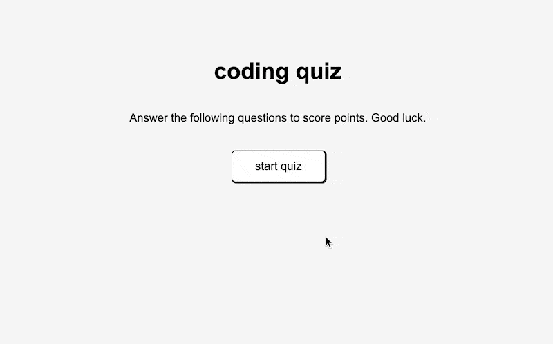

## 04 Web APIs: Code Quiz

### The Project

To practice for potential projects in a typical coding assessment, this project is to build an interactive coding challenge page that utilizes multiple-choice questions.

This page application will run in the browser and build from HTML and CSS, powered by JavaScript. It will be clean, user-friendly, and responsive in its interface. 

### User Story

```
AS A coding boot camp student
I WANT to take a timed and scored coding quiz to test my knowledge 
SO THAT I can gauge my progress compared to others
```

### Project Outline

```
GIVEN I am at the quiz hompage
WHEN I click on the start quiz button
THEN a timer would start running along with visibility of the first question
WHEN I answer a question regardless of correct or incorrect
THEN I am presented with another question
WHEN I failed to answer a question correctly
THEN time is deductd from the clock and I get a text feedback
WHEN I answer a question correctly
THEN I get points added to my score and a text feedback
WHEN all questions are answered
THEN the game is over
WHEN I am presented with the result page
THEN I can save my initials and my score
```

### Mock-Up

The following animation demonstrates the application functionality:




### Credits
* Huge help from Scott Nelson, Wilson Lam, Angie Soto, Nifer Kilakila, Asha Chakre, and Nolan Spencer